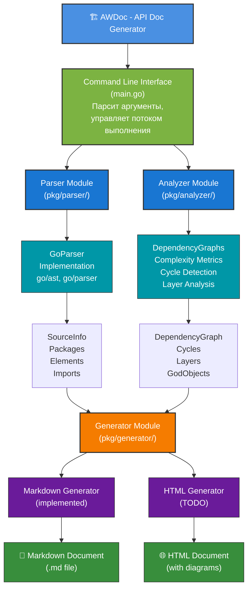
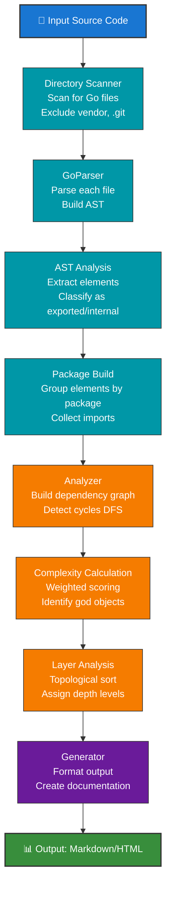
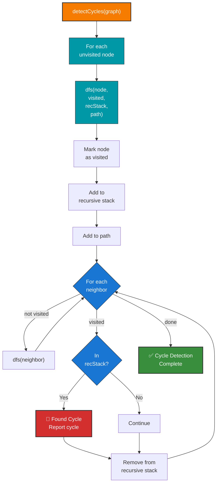
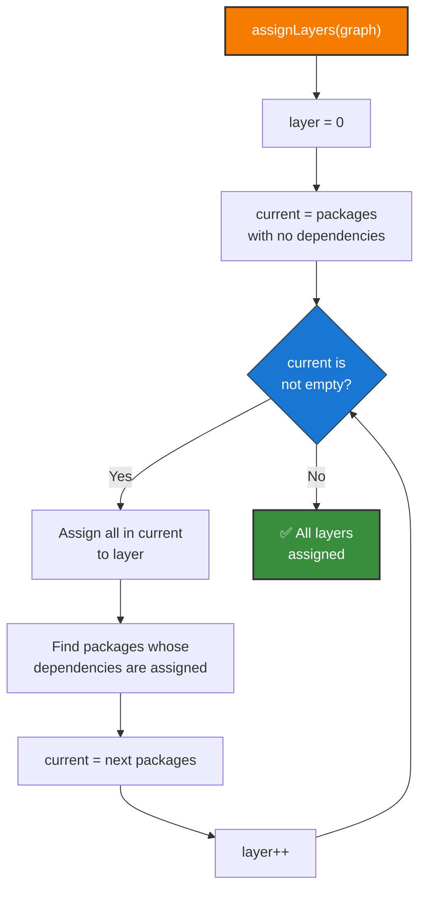
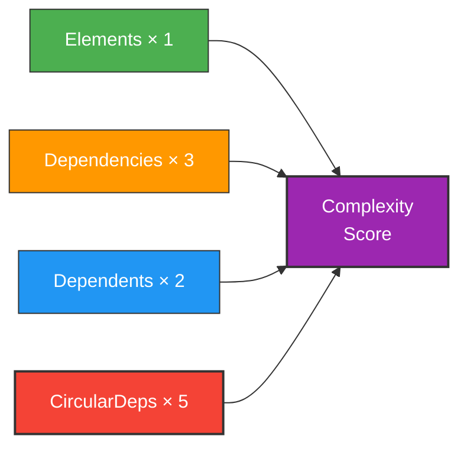
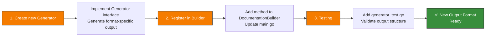

# AWDoc - Architecture & Design

## System Architecture



## Component Breakdown

### 1. Parser Module (`pkg/parser/`)

**Responsibility:** Extract code structure from source files

**Classes:**

- `GoParser` - Parse Go source files using go/ast
- `Parser` (interface) - abstraction for different languages

**Key Exports:**

- `ParseProject(dir, lang)` - main entry point
- `CodeElement` - represents functions, types, etc.
- `Package` - represents a code package
- `SourceInfo` - container for all analysis data

**Dependencies:**

- Go standard library: `go/parser`, `go/ast`, `go/token`
- No external dependencies

**Complexity:** O(n) where n = number of files

### 2. Analyzer Module (`pkg/analyzer/`)

**Responsibility:** Analyze package relationships and complexity

**Classes:**

- `Analyzer` - main analysis engine
- `PackageNode` - node in dependency graph
- `DependencyGraph` - mathematical graph structure

**Key Exports:**

- `Analyze()` - build graph and metrics
- `GetDependencyInfo()` - query single package

**Algorithms:**

- **DFS Cycle Detection** - O(V+E) where V=packages, E=dependencies
- **Layer Assignment** - topological sort
- **Complexity Calculation** - weighted scoring

**Dependencies:**

- `pkg/parser` for data structures

**Complexity:** O(V²) worst case (with cycles)

### 3. Generator Module (`pkg/generator/`)

**Responsibility:** Create human-readable documentation

**Classes:**

- `MarkdownGenerator` - generate Markdown output
- `DocumentationBuilder` - facade for all generators

**Key Exports:**

- `GenerateProjectDoc()` - main generation method
- `DocumentationBuilder` - builder pattern

**Output Formats:**

1. Markdown - text-based, version control friendly
2. HTML (planned) - interactive, with diagrams

**Dependencies:**

- `pkg/parser` and `pkg/analyzer` for data
- Go standard library

**Complexity:** O(n) where n = number of elements

## Data Structures

### SourceInfo

```go
type SourceInfo struct {
    Files       []string              // files found
    RootDir     string                // analysis root
    Packages    map[string]*Package   // all packages
}
```

### Package

```go
type Package struct {
    Name        string              // package name
    Path        string              // import path
    Doc         string              // package docs
    Elements    []CodeElement       // all elements
    Imports     map[string]bool     // imported packages
    ExportedAPI []CodeElement       // only exported
}
```

### CodeElement

```go
type CodeElement struct {
    Name       string        // identifier name
    Type       ElementType   // function, type, method, etc.
    Exported   bool          // is it exported?
    Doc        string        // documentation
    Signature  string        // function signature
    Params     []Parameter   // function parameters
    Returns    []Parameter   // return values
    SourceFile string        // source file path
    StartLine  int           // line number
    EndLine    int           // line number
}
```

### DependencyGraph

```go
type DependencyGraph struct {
    Nodes      map[string]*PackageNode  // nodes
    Edges      map[string][]string      // adjacency list
    Cycles     [][]string               // circular deps
    Layers     [][]string               // topological layers
    GodObjects []string                 // complex packages
}
```

## Processing Pipeline



## Algorithm Details

### Cycle Detection (DFS)



**Time Complexity:** O(V + E)
**Space Complexity:** O(V)

### Layer Assignment (Topological Sort)



**Time Complexity:** O(V²) worst case
**Space Complexity:** O(V)

### Complexity Scoring



**Factors:**

1. **Elements (weight 1):** More code = more complexity
2. **Dependencies (weight 3):** External dependencies increase risk
3. **Dependents (weight 2):** More impact if broken
4. **Circular (weight 5):** Major architecture issue

## Design Patterns Used

### 1. Parser Pattern

- **Interface-based:** `Parser` interface allows multiple implementations
- **Factory Method:** `NewParser()` creates language-specific parsers
- **Strategy Pattern:** Each `Parser` implements different parsing strategy

### 2. Builder Pattern

- `DocumentationBuilder` constructs complex documents
- Separates construction from representation
- Allows different output formats

### 3. Adapter Pattern

- `GoParser` adapts Go's `ast` package to our `CodeElement` model
- Hides language-specific details

### 4. Facade Pattern

- `DocumentationBuilder` provides simplified interface
- Hides complexity of multiple generators

## Extension Points

### Adding New Language Support


### Adding New Output Format



## Performance Characteristics

| Operation | Complexity | Notes |
| --- | --- | --- |
| Parse file | O(n) | where n = file size |
| Parse project | O(m) | where m = total lines of code |
| Detect cycles | O(V+E) | V = packages, E = dependencies |
| Assign layers | O(V²) | worst case with many deps |
| Generate docs | O(n) | where n = number of elements |
| **Total** | **O(V² + m)** | dominated by analysis |

**Typical times:**

- Small project (10 packages, 1K elements): < 100ms
- Medium project (50 packages, 5K elements): 200-500ms
- Large project (100+ packages, 10K+ elements): 1-3 seconds

## Dependencies

### External

- None for parser and analyzer
- Standard Go library only

### Internal

- `parser` used by `analyzer` and `generator`
- `analyzer` used by `generator`
- No circular dependencies

## Error Handling

### Parser Errors

- File not found → log and continue
- Invalid syntax → log with line number
- Unsupported construct → skip element

### Analyzer Errors

- Invalid graph → return error
- Infinite loops in cycles → timeout protection

### Generator Errors

- File write errors → return error
- Template errors → return error

## Concurrency

Current implementation is **single-threaded**:

- Parser processes files sequentially
- Analyzer runs single-threaded
- Generator creates output sequentially

**Future optimization:**

- Parallel file parsing with sync.WaitGroup
- Concurrent analysis of independent packages
- Parallelized document generation
