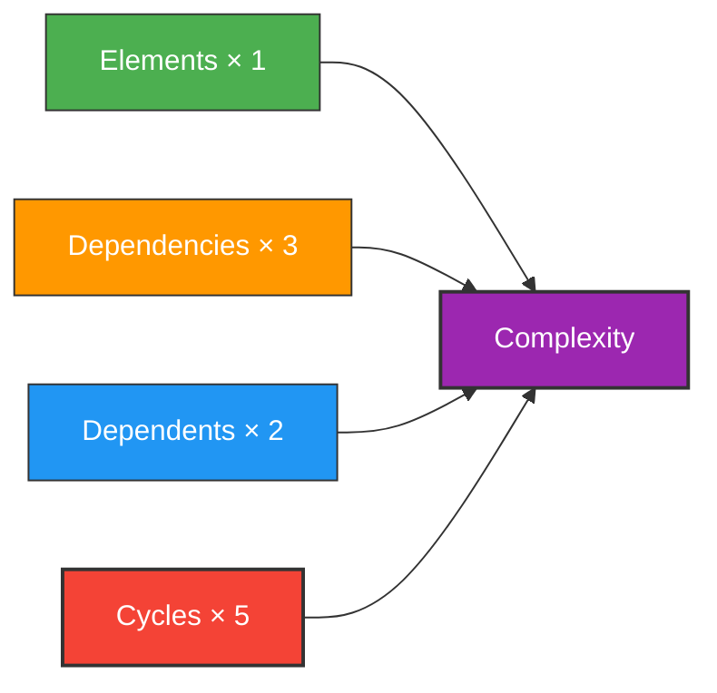
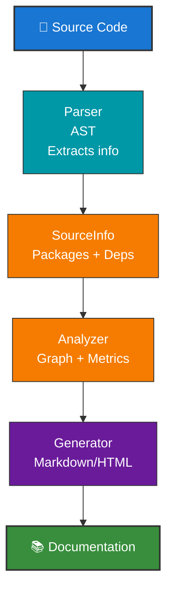

# AWDoc - Developer Guide

## Architecture Overview

AWDoc состоит из трёх основных компонентов:

### 1. Parser (`pkg/parser/`)

**Назначение:** Анализирует исходный код и извлекает структурированную информацию.

**Ключевые типы:**

- `CodeElement` - представляет функцию, метод, тип, константу и т.д.
- `Package` - представляет Go пакет с его элементами и импортами
- `Parser` - интерфейс для реализации парсеров разных языков

**Главный файл:** `go_parser.go`

**Что он делает:**

1. Парсит Go файлы используя встроенный `go/parser`
2. Строит AST (Abstract Syntax Tree) для каждого файла
3. Извлекает:
   - Функции и методы с сигнатурами
   - Типы, структуры, интерфейсы
   - Константы и переменные
   - Документацию из комментариев
   - Импорты пакетов
4. Классифицирует элементы как экспортируемые или внутренние

**Пример использования:**

```go
parser := &GoParser{}
pkg, err := parser.Parse("myfile.go")
elemCount := len(pkg.Elements)
exportedCount := len(pkg.ExportedAPI)
```

### 2. Analyzer (`pkg/analyzer/`)

**Назначение:** Анализирует структуру проекта и выявляет архитектурные проблемы.

**Ключевые типы:**

- `DependencyGraph` - граф зависимостей между пакетами
- `PackageNode` - узел графа с метаинформацией о пакете
- `Analyzer` - движок анализа

**Главный файл:** `analyzer.go`

**Что он делает:**

1. **Строит граф зависимостей** на основе импортов пакетов
2. **Обнаруживает циклические зависимости** используя DFS алгоритм
3. **Вычисляет сложность пакетов** учитывая:
   - Количество элементов кода
   - Количество зависимостей
   - Количество зависимых пакетов
   - Циклические зависимости (штраф)
4. **Определяет архитектурные слои** - группирует пакеты по глубине зависимостей
5. **Выявляет "god objects"** - пакеты с высокой сложностью

**Метрики сложности:**



**Пример использования:**

```go
analyzer := NewAnalyzer(sourceInfo)
graph, _ := analyzer.Analyze()

// Анализируем результаты
fmt.Printf("Циклы: %d\n", len(graph.Cycles))
fmt.Printf("God objects: %v\n", graph.GodObjects)
fmt.Printf("Слои: %d\n", len(graph.Layers))
```

### 3. Generator (`pkg/generator/`)

**Назначение:** Генерирует красивую документацию на основе анализа.

**Ключевые типы:**

- `MarkdownGenerator` - генерирует Markdown документацию
- `DocumentationBuilder` - фасад для всех генераторов

**Главные файлы:**

- `markdown.go` - генератор Markdown
- `generator.go` - интерфейсы и builder

**что он делает:**

1. **Создаёт оглавление** проекта
2. **Генерирует документацию для каждого пакета**:
   - Описание пакета
   - Список импортов
   - Документация для каждого элемента (экспортируемые и внутренние)
3. **Создаёт раздел архитектурного анализа**:
   - Архитектурные слои
   - Циклические зависимости с предупреждениями
   - God objects с рекомендациями
   - Граф зависимостей в текстовом виде

**Пример использования:**

```go
builder := NewDocumentationBuilder(sourceInfo, graph)
markdown := builder.BuildMarkdown()
os.WriteFile("docs.md", []byte(markdown), 0644)
```

## Data Flow



## Adding Support for New Languages

Чтобы добавить поддержку нового языка:

1. **Создайте новый парсер** в `pkg/parser/`:

```go
type PythonParser struct{}

func (pp *PythonParser) Parse(filePath string) (*Package, error) {
    // Реализуйте парсинг Python файла
    return &Package{...}, nil
}

func (pp *PythonParser) ParseDir(dirPath string) (*SourceInfo, error) {
    // Реализуйте парсинг директории
    return &SourceInfo{...}, nil
}
```

1. **Зарегистрируйте парсер** в `NewParser()`:

```go
func NewParser(language string) (Parser, error) {
    switch strings.ToLower(language) {
    case "go":
        return &GoParser{}, nil
    case "python":
        return &PythonParser{}, nil
    default:
        return nil, fmt.Errorf("unsupported language: %s", language)
    }
}
```

1. **Обновите DirScanner**:

```go
func NewDirScanner(language string) *DirScanner {
    // Добавьте логику для нового языка
}
```

## Testing

Проект включает unit-тесты для всех основных компонентов:

```bash
# Запустить все тесты
go test -v ./...

# Запустить тесты конкретного пакета
go test -v ./pkg/parser

# Запустить с покрытием
go test -cover ./...
```

## Future Enhancements

### High Priority

- [ ] Поддержка Python, Rust, C++
- [ ] HTML генератор с интерактивными диаграммами (Mermaid)
- [ ] Web UI для просмотра документации
- [ ] Интеграция с CI/CD (GitHub Actions, GitLab CI)

### Medium Priority

- [ ] Экспорт в JSON/XML
- [ ] Custom шаблоны для документации
- [ ] Анализ test coverage
- [ ] Performance metrics

### Low Priority

- [ ] Плагины для расширения функциональности
- [ ] Rest API для análysis
- [ ] IDE интеграция (VS Code extension)
- [ ] Сравнение версий проекта

## Performance Considerations

- Parser использует встроенный Go AST парсер - очень быстро
- Analyzer использует DFS для обнаружения циклов - O(V+E) где V=пакеты, E=зависимости
- Generator прямолинейно создает документацию - O(N) где N=элементы

На типичном проекте (100+ пакетов, 10000+ элементов) анализ занимает < 1 секунды.

## Troubleshooting

### Parser не находит экспортируемые элементы

- Убедитесь что имена начинаются с заглавной буквы (Go convention)
- Проверьте что файлы имеют расширение `.go`

### Граф зависимостей пустой

- Проверьте что импорты указывают на пакеты внутри проекта
- Внешние зависимости (fmt, io, etc.) пропускаются

### Анализ медленный

- Уменьшите размер анализируемой директории
- Исключите папки vendor, node_modules, .git через DirScanner
