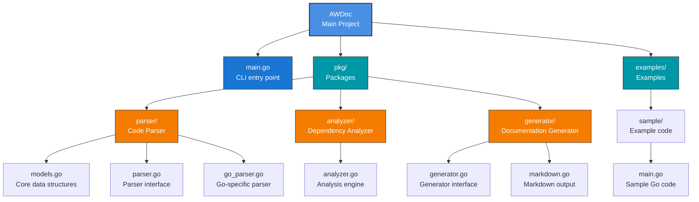

# AWDoc - Automatic Web Documentation Generator

A powerful Go-based tool for analyzing source code and generating comprehensive API documentation with dependency analysis.

## Features

### 1. **Code Parser** (`pkg/parser/`)

- Parses Go source files using the Go AST
- Extracts:
  - Exported identifiers (functions, methods, types, constants)
  - Documentation from comments
  - Function signatures and parameters
  - Return types
  - Package imports and dependencies

### 2. **Dependency Analyzer** (`pkg/analyzer/`)

- Builds a dependency graph of packages
- Identifies:
  - **Circular dependencies** - detects problematic dependency cycles
  - **God Objects** - packages with high complexity that may need refactoring
  - **Architectural Layers** - organizes packages by dependency depth
  - **Complexity Metrics** - combines multiple factors (elements, dependencies, dependents)

### 3. **Documentation Generator** (`pkg/generator/`)

- Generates structured API documentation in multiple formats:
  
  **Markdown Format:**
  - Package overview
  - Exported and internal API documentation
  - Architecture analysis with diagrams (text-based)
  - Dependency graph visualization
  - Quality warnings and recommendations
  
  **HTML Format (NEW):**
  - Responsive web interface
  - Beautiful gradient design with modern CSS
  - Interactive navigation menu
  - Statistical cards with key metrics
  - Collapsible sections for better readability
  - Mobile-friendly responsive layout
  - Embedded styles (no external dependencies)

## Project Structure



## Installation

```bash
# Clone the repository
cd AWDoc

# Build the project
go build -o awdoc main.go

# Or run directly
go run main.go -source ./examples -lang go -output docs.md
```

## Usage

### Basic Usage

```bash
# Analyze current directory (Markdown output)
./awdoc -source . -lang go -output api-docs.md

# Analyze a specific package
./awdoc -source ./pkg -lang go -output pkg-docs.md

# Generate HTML documentation
./awdoc -source . -lang go -format html -output docs.html

# Generate HTML with custom styling
./awdoc -source ./examples/complex -lang go -format html -output api.html

# Open HTML documentation in browser
start docs.html  # Windows
open docs.html   # macOS
xdg-open docs.html  # Linux
```

### Output Formats

#### Markdown Format (default)

- Perfect for Git repositories
- Works with GitHub, GitLab rendering
- Easy to version control
- Command: `./awdoc -format markdown` (or omit -format)

#### HTML Format

- Beautiful visual presentation
- No dependencies required (embedded CSS)
- Responsive mobile-friendly design
- Easy sharing and publishing
- Command: `./awdoc -format html`

### Command Line Options

- `-source` (string): Directory to analyze (default: ".")
- `-lang` (string): Programming language (default: "go")
- `-output` (string): Output file path (default: "docs.md")
- `-format` (string): Output format - "markdown" or "html" (default: "markdown")

## Data Structures

### CodeElement

Represents a code element (function, type, constant, etc.)

```go
type CodeElement struct {
    Name       string       // Element name
    Type       ElementType  // Type of element (func, method, type, etc.)
    Exported   bool         // Is it exported?
    Doc        string       // Documentation from comments
    Signature  string       // Function signature
    Params     []Parameter  // Function parameters
    Returns    []Parameter  // Return values
    SourceFile string       // Source file path
    StartLine  int          // Starting line number
    EndLine    int          // Ending line number
}
```

### DependencyGraph

Represents the package dependency graph

```go
type DependencyGraph struct {
    Nodes      map[string]*PackageNode  // Package nodes
    Edges      map[string][]string      // Dependencies
    Cycles     [][]string               // Circular dependencies
    Layers     [][]string               // Architectural layers
    GodObjects []string                 // Complex packages
}
```

## Example Output

When you run the analyzer on a Go project, you get:

1. **Package Overview**
   - Total packages count
   - Total code elements
   - Exported vs internal API size

2. **Per-Package Documentation**
   - Functions and their signatures
   - Methods with receivers
   - Types and structs
   - Constants and variables
   - Documentation from comments

3. **Architecture Analysis**
   - Dependency graph visualization
   - Architectural layers (dependency depth)
   - Circular dependency warnings
   - God object identification with complexity metrics

## Complexity Metrics

The analyzer combines multiple factors to identify god objects:

- **Elements**: Number of code elements in the package
- **Dependencies**: Count of external package dependencies
- **Dependents**: Count of packages depending on this package
- **Circular Dependencies**: Penalty for participating in cycles

## Future Enhancements

- [ ] Support for multiple languages (Python, Rust, C++, etc.)
- [x] Basic HTML output with responsive design
- [ ] Interactive HTML output with diagrams (Mermaid/GraphViz)
- [ ] Web interface for browsing documentation
- [ ] Integration with common CI/CD systems
- [ ] Custom templates for documentation generation
- [ ] Export to multiple formats (JSON, XML, etc.)
- [ ] Test coverage integration
- [ ] Performance metrics and profiling info
- [ ] Dark mode for HTML documentation
- [ ] Search functionality in HTML output

## Contributing

Feel free to submit issues and enhancement requests!

## License

MIT License
