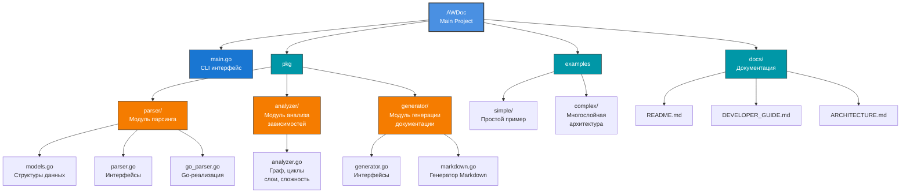
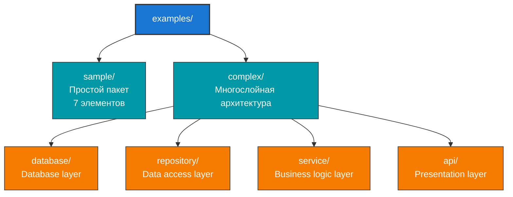

# AWDoc - Генератор документации для Go кода

**Автоматизируйте документирование вашего Go проекта!**

AWDoc - это инструмент на Go для анализа исходного кода, построения графа зависимостей и автоматической генерации красивой API документации в формате Markdown.

## 🎯 Основные возможности

### 1️⃣ Анализатор кода

- Парсит Go файлы используя встроенный `go/ast`
- Извлекает функции, методы, типы, константы, переменные
- Извлекает документацию из комментариев
- Определяет экспортируемые vs внутренние элементы
- Собирает информацию об импортах

### 2️⃣ Анализатор зависимостей

- Строит граф зависимостей пакетов
- Обнаруживает циклические зависимости
- Вычисляет сложность пакетов
- Определяет архитектурные слои
- Выявляет "божественные объекты" (god objects)

### 3️⃣ Генератор документации

- Создаёт структурированное описание API
- Документирует каждый пакет и элемент
- Включает анализ архитектуры
- Выделяет проблемы и риски
- Выводит в Markdown (HTML - в разработке)

## 🚀 Быстрый старт

### Установка

```bash
# Клонируем репозиторий
git clone <url>
cd AWDoc

# Собираем проект
go build -o awdoc main.go
```

### Использование

```bash
# Анализируем проект (результат сохранится в output/analysis.md)
./awdoc -source ./myproject -lang go

# Анализируем конкретный пакет
./awdoc -source ./pkg -lang go

# С пользовательской папкой для результатов
./awdoc -source ./myproject -output-dir ./documentation

# С пользовательским именем файла
./awdoc -source ./myproject -output ./custom-docs/api.md

# Смотрим результат
cat output/analysis.md
```

## 📊 Пример выходных данных

```markdown
# API Documentation

## Project Overview
**Total Packages:** 4
**Total Elements:** 27

## Packages

### Package: `service`
**Description:** Provides business logic

**Imports:**
- `repository`
- `fmt`

#### Exported Elements

**Functions:**
- **`NewUserService`** (function)
  ```go
  func NewUserService(repo *UserRepository) *UserService
  ```

  Creates new service instance

**Methods:**

- **`RegisterUser`** (method)

  ```go
  func (*UserService) RegisterUser(name, email string) error
  ```

  Registers a new user

...

## Architecture Analysis

### Architectural Layers

**Layer 0:**

- database

**Layer 1:**

- repository

**Layer 2:**

- service

**Layer 3:**

- api

### Complex Packages

- **service** (Complexity: 7, Dependencies: 1)

## 🏗️ Архитектура проекта



## 💻 Опции командной строки

```ps
awdoc [flags]

Flags:
  -source      Directory to analyze (default: ".")
  -lang        Programming language: go, python, rust (default: "go")
  -output      Output file path (overrides -output-dir)
  -output-dir  Output directory for documentation (default: "output")
  -format      Output format: markdown, html (default: "markdown")

```

### Примеры команд

```bash
# Анализ текущей директории (результат в output/analysis.md)
./awdoc -source .

# Анализ конкретной папки (результат в output/analysis.md)
./awdoc -source ./pkg -lang go

# С пользовательской папкой для результатов
./awdoc -source ./src -output-dir ./docs

# С пользовательским путём к файлу
./awdoc -source . -output ./results/api-docs.md

# HTML выход (когда реализуется)
./awdoc -source . -lang go -format html -output-dir ./html-docs
```

## 🎓 Примеры использования

### 1. Простой проект

```bash
./awdoc -source ./examples/sample -lang go -output output/sample-analysis.md
```

Результат: документация для 1 пакета с 7 элементами

### 2. Сложная архитектура

```bash
./awdoc -source ./examples/complex -lang go -output output/arch-analysis.md
```

Результат: анализ 4 пакетов, выявление слоев и зависимостей

### 3. Весь проект

```bash
./awdoc -source ./pkg -lang go -output project-docs.md
```

Результат: полная документация всех пакетов проекта

## 🔍 Метрики анализа

### Сложность пакета

Вычисляется как:

```txt
Complexity = Elements×1 + Dependencies×3 + Dependents×2 + Cycles×5
```

**Интерпретация:**

- 0-10: Простой пакет ✅
- 10-20: Средняя сложность ⚠️
- 20-50: Высокая сложность 🔴
- 50+: Критическая, нужен рефакторинг 🚨

### Архитектурные слои

Пакеты группируются по глубине зависимостей:

- **Layer 0:** Независимые пакеты (фундамент)
- **Higher layers:** Зависят от нижних слоев

Хорошая архитектура: 3-5 слоев, пирамидальная структура

### Циклические зависимости

Выявляются автоматически и отмечаются как проблемы:

- Усложняют тестирование
- Затрудняют переиспользование кода
- Увеличивают время сборки

## 🧪 Тестирование

```bash
# Запустить все тесты
go test -v ./...

# Тесты парсера
go test -v ./pkg/parser

# Тесты анализатора
go test -v ./pkg/analyzer

# Тесты генератора
go test -v ./pkg/generator
```

**Результат:** 8/8 тестов пройдены ✅

## 📈 Демонстрация

```bash
# Запустить программу демонстрации
powershell -ExecutionPolicy Bypass -File demo.ps1

# или на Linux/macOS
bash demo.sh
```

Демо автоматически:

1. Собирает проект
2. Анализирует примеры
3. Генерирует документацию
4. Запускает тесты
5. Показывает статистику

## 📚 Документация

- **[DEVELOPER_GUIDE.md](DEVELOPER_GUIDE.md)** - Для разработчиков, архитектура
- **[ARCHITECTURE.md](ARCHITECTURE.md)** - Детальная архитектура системы
- **[USAGE_EXAMPLES.md](USAGE_EXAMPLES.md)** - Практические примеры

## 🚀 Интеграция с CI/CD

### GitHub Actions

```yaml
- name: Generate Documentation
  run: |
    go build -o awdoc main.go
    ./awdoc -source . -lang go -output docs.md
    
- name: Upload Docs
  uses: actions/upload-artifact@v3
  with:
    name: api-docs
    path: docs.md
```

### GitLab CI

```yaml
analyze:
  script:
    - go build -o awdoc main.go
    - ./awdoc -source . -lang go -output docs.md
  artifacts:
    paths:
      - docs.md
```

## 🎯 Варианты использования

### 1. Документирование API

```bash
./awdoc -source ./api -lang go -output api-docs.md
# Делитесь исх docs с клиентами
```

### 2. Архитектурный аудит

```bash
./awdoc -source . -lang go -output audit.md
# Проверьте слои, циклы, сложность пакетов
```

### 3. Onboarding новых разработчиков

```bash
./awdoc -source . -lang go -output project-guide.md
# Новичкам дайте этот файл для изучения проекта
```

### 4. Код ревью

```bash
# Перед PR анализируйте изменённые пакеты
./awdoc -source ./modified-pkg -lang go -output review.md
```

## ⚙️ Требования

- **Go:** 1.21 или выше
- **ОС:** Linux, macOS, Windows
- **Зависимости:** Только стандартная библиотека Go

## 🔮 Будущие улучшения

### Высокий приоритет

- [ ] HTML генератор с интерактивными диаграммами
- [ ] Поддержка Python, Rust, C++
- [ ] Web интерфейс для просмотра документации
- [ ] VS Code расширение

### Средний приоритет

- [ ] JSON/XML экспорт
- [ ] Кастомные шаблоны документации
- [ ] Интеграция с coverage
- [ ] Performance metrics

### Низкий приоритет

- [ ] IDE плагины
- [ ] REST API
- [ ] Система плагинов
- [ ] Сравнение версий

## 💡 Примеры в проекте



Каждый пример демонстрирует разные аспекты анализатора.

## 🤝 Вклад в проект

AWDoc открыт для улучшений! Вы можете:

1. **Добавить поддержку других языков** - реализуйте интерфейс `Parser`
2. **Улучшить анализ** - добавьте новые метрики в `Analyzer`
3. **Новые форматы вывода** - создайте новый генератор
4. **Документацию** - улучшайте и проясняйте

## 📄 Лицензия

MIT License - свободен для использования

## 📞 Поддержка

Вопросы и замечания:

- Откройте Issue на GitHub
- Посмотрите документацию в `/docs`
- Изучите примеры в `/examples`

## 🎉 Спасибо за использование AWDoc

Надеемся, что этот инструмент поможет вам лучше документировать и анализировать ваши Go проекты.

---

**Версия:** 1.0.0  
**Статус:** Production-ready MVP  
**Дата:** Апрель 2026
