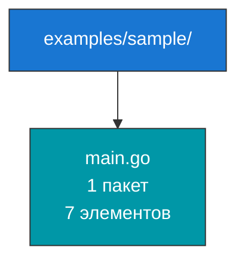
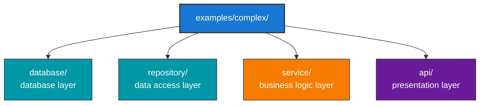
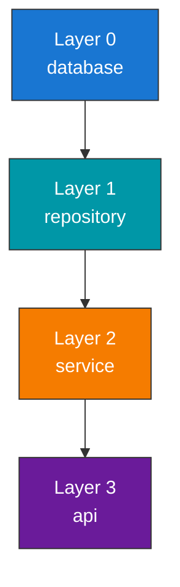
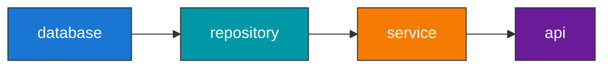
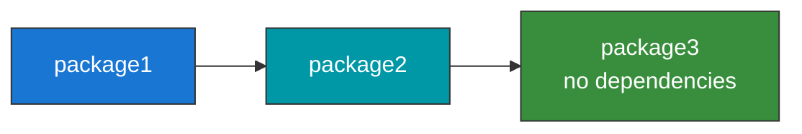

# AWDoc - Usage Examples

## Quick Start

### 1. Анализ простого проекта

```bash
# Анализируем текущую директорию (сохранится в output/analysis.md)
./awdoc -source . -lang go

# Смотрим результат
cat output/analysis.md
```

### 2. Анализ конкретного пакета с пользовательским файлом

```bash
./awdoc -source ./pkg -lang go -output output/pkg-analysis.md
```

### 3. Анализ с пользовательской папкой вывода

```bash
./awdoc -source . -lang go -output-dir ./docs
```

## CLI Options

```text
awdoc [flags]

Flags:
  -source      Directory to analyze (default: ".")
  -lang        Programming language: go, python, rust, etc. (default: "go")
  -output-dir  Directory for output files (default: "output")
  -output      Output file path (overrides -output-dir)
  -format      Output format: markdown, html (default: "markdown")
```

## Example Projects

### Пример 1: Простой пакет (examples/sample/)

Структура:



Команда:

```bash
./awdoc -source ./examples/sample -lang go -output output/sample-analysis.md
```

Результат в `output/sample-analysis.md`:

```markdown
# API Documentation

## Project Overview
**Total Packages:** 1
**Total Elements:** 7

## Packages

### Package: `main`

#### Exported Elements

**Functions:**
- **`ExamplePrintMessage`** (function)
  ```go
  func ExamplePrintMessage(message string)
  ```

**Structs:**

- **`ServiceA`** (struct)
  ServiceA provides core functionality

- **`ServiceB`** (struct)
  ServiceB depends on ServiceA

...

### Пример 2: Многослойная архитектура (examples/complex/)

Структура:



Команда:

```bash
./awdoc -source ./examples/complex -lang go -output output/complex-analysis.md
```

Результат содержит:

- Документацию для 4 пакетов
- Архитектурные слои:



- Граф зависимостей:



- Анализ сложности пакетов

## Output Format Details

### Generated Markdown Structure

```markdown
# API Documentation

## Table of Contents
- [Project Overview](#project-overview)
- [Packages](#packages)
- [Architecture Analysis](#architecture-analysis)

## Project Overview
**Total Packages:** N
**Total Elements:** M

## Packages

### Package: `package_name`
**Description:** Package documentation from comments

**Imports:**
- `external/package`
- `internal/package`

#### Exported Elements

**Functions:**
- **`FunctionName`** (function)
  ```go
  func FunctionName(arg string) (result, error)
  ```

  Documentation from comments

**Methods:**

- **`MethodName`** (method)

  ```go
  func (*ReceiverType) MethodName() error
  ```

**Structs:**

- **`StructName`** (struct)
  Struct documentation

**Interfaces:**

- **`InterfaceName`** (interface)
  Interface documentation

**Constants:**

- **`CONST_NAME`** (const)

**Variables:**

- **`VarName`** (var)

#### Internal Elements

(same structure as Exported Elements)

---

## Architecture Analysis

### Architectural Layers

**Layer 0:** (independent packages)

- package1
- package2

**Layer 1:** (depends on Layer 0)

- package3

...

### Circular Dependencies Detected

- [cyclical packages list]

### Complex Packages (God Objects)

Packages with high complexity:

- **package_name** (Complexity: 15, Dependencies: 5)

### Dependency Graph



## Interpreting Results

### Complexity Score

Сложность вычисляется как:

```txt
Complexity = Elements×1 + Dependencies×3 + Dependents×2 + Cycles×5
```

**Интерпретация:**

- **0-10:** Простой пакет (OK)
- **10-20:** Средняя сложность (нормально, но следить)
- **20-50:** Высокая сложность (рассмотреть рефакторинг)
- **50+:** Очень высокая (срочный рефакторинг)

### Archicture Layers

Слои показывают **глубину зависимостей**:

- Layer 0: Фундамент (самые независимые пакеты)
- Higher layers: Пакеты, зависящие от нижних слоев

**Хорошая архитектура:** 3-5 слоев, пирамидальная структура
**Плохая архитектура:** > 10 слоев, циклические зависимости

### God Objects

"Божественные объекты" - пакеты с избыточной сложностью:

**Признаки:**

- Много элементов (функций/типов)
- Много зависимостей (импортов)
- На них зависит много пакетов
- Участвуют в циклических зависимостях

**Рекомендация:** Рассмотрите рефакторинг на меньшие пакеты

## Practical Use Cases

### 1. Code Review

```bash
# Перед мерджем PR анализируем изменённые пакеты
./awdoc -source ./modified-packages -lang go -output pr-analysis.md
# Проверяем:
# - Нет ли новых циклических зависимостей
# - Не увеличилась ли сложность
# - Соответствии архитектурным слоям
```

### 1. Onboarding новых разработчиков

```bash
# Генерируем полную документацию проекта
./awdoc -source . -lang go -output project-overview.md
# Результат используется для обучения новых членов команды
```

### 2. Архитектурный аудит

```bash
# Анализируем текущую архитектуру
./awdoc -source . -lang go -output architecture-audit.md
# Смотрим:
# - Количество слоев
# - Циклические зависимости
# - God objects
# - Общую структуру проекта
```

### 3. Интеграция с CI/CD

```bash
# В GitHub Actions или GitLab CI
- name: Analyze Code Architecture
  run: |
    docker run myregistry/awdoc:latest \
      -source /workspace \
      -lang go \
      -output docs/architecture.md
```

## Automation Script

Пример скрипта для регулярного анализа:

```bash
#!/bin/bash
# analyze-project.sh

PROJECT_DIR=${1:-.}
OUTPUT_DIR="./docs"
TIMESTAMP=$(date +%Y%m%d_%H%M%S)

mkdir -p $OUTPUT_DIR

echo "🔍 Analyzing project structure..."
./awdoc \
  -source $PROJECT_DIR \
  -lang go \
  -output "$OUTPUT_DIR/architecture_$TIMESTAMP.md"

echo "✓ Analysis complete: $OUTPUT_DIR/architecture_$TIMESTAMP.md"

# Опционально: генерируем HTML если поддерживается
# ./awdoc -source $PROJECT_DIR -format html -output "$OUTPUT_DIR/architecture_$TIMESTAMP.html"
```

Использование:

```bash
chmod +x analyze-project.sh
./analyze-project.sh ./src
```

## Common Issues & Solutions

### Issue 1: "No packages found"

**Проблема:** Анализ не находит пакеты

**Решение:**

- Проверьте что файлы имеют расширение `.go`
- Убедитесь что пакеты объявлены правильно `package name`
- Попробуйте явно указать путь к файлам

### Issue 2: "Empty dependency graph"

**Проблема:** Граф зависимостей пустой

**Решение:**

- Пакеты должны импортировать друг друга
- Внешние импорты (fmt, io) не показываются
- Проверьте что импорты указывают на пакеты в проекте

### Issue 3: Slow analysis

**Проблема:** Анализ долгий

**Решение:**

- Исключите vendor/, .git/, node_modules/
- Анализируйте меньшие папки
- Используйте более мощный компьютер

## Performance Tips

1. **Кэширование результатов**

   ```bash
   # Сохраняйте результаты анализа
   # Пересчитывайте только при изменении кода
   ```

2. **Параллельный анализ**

   ```bash
   # Можно анализировать несколько проектов одновременно
   ./awdoc -source ./project1 &
   ./awdoc -source ./project2 &
   wait
   ```

3. **Выборочный анализ**

   ```bash
   # Анализируйте только интересующие папки
   ./awdoc -source ./pkg/core -lang go -output core-analysis.md
   ```
